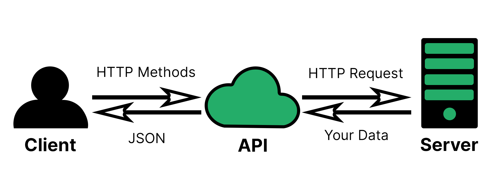
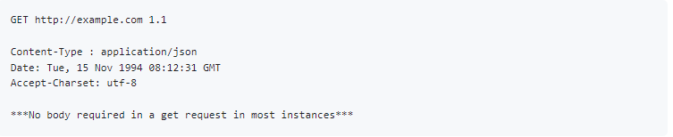
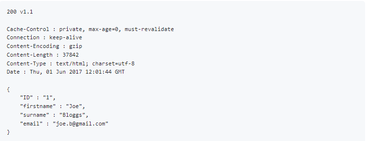

# APIs - Application Programming Interface

### What is an API?

An API is a way to transfer data from a separate server or service (independent of the language involved).

An API, or **A**pplication **P**rogramming **I**nterface, is a set of rules that define how applications or devices can connect to and communicate with each other (i.e. it is a set of definitions and protocols for building and integrating application software).
In other words, if you want to interact with a computer or system to retrieve information or perform a function, an API helps you communicate what you want to that system, so it can understand and fulfill the request. You can think of an API as a mediator between the users or clients and the resources or web services they want to get.




Why are APIs popular?

APIs let your product or service communicate with other products and services without having to know how they’re implemented. This can simplify app development, saving time and money. When you’re designing new tools and products—or managing existing ones—APIs give you flexibility; simplify design, administration, and use; and provide opportunities for innovation. APIs are also a way for an organization to share resources and information while maintaining security, control, and authentication—determining who gets access to what. Another advantage of an API is that you don’t have to know the specifics of caching—how your resource is retrieved or where it comes from

[RedHat - What is an API?](https://www.redhat.com/en/topics/api/what-are-application-programming-interfaces)

### What is a REST API?

**R**epresentational **S**tate **T**ransfer **API**.

A REST API is an API that conforms to the design principles of the REST, or representational state transfer architectural style. Representational state transfer or simply REST is a term for exchanging data in well-defined formats in order to increase interoperability. (i.e. A REST API is a standardized approach to building APIs that entails using the representational state transfer (REST) architectural style to communicate with servers.)

REST APIs are lightweight, maintainable, scalable.

What makes an API RESTful?

- **Representation and data flow** (layered system - each layer has a single purpose; uniform interface - all API requests should be identical when they try to gain access to the same resource; client server - the client and server are completely separated (only interact through API); null style - architecture style where you start with no constraints and then start layering constraints on top of each other in a controlled and logical way)
- **Messages** (right amount of context around requests)
- **Unique URIs/naming** (unique resource identifier)
- **Statelessness** (meaning no client information is stored between get requests and each request is separate and unconnected i.e. All API calls must contain all the information needed for processing a request without any stored context on the server)
- **Caching** (streamlines client-server interactions, loads faster i.e. reusable resources should be stored on the client or server to optimize the performance)

[IBM - The REST API](https://www.ibm.com/docs/en/odm/8.8.1?topic=resources-rest-api)

When a client request is made via a RESTful API, it transfers a representation of the state of the resource to the requester or endpoint. This information, or representation, is delivered in one of several formats via HTTP: JSON (Javascript Object Notation), HTML, XLT, Python, PHP, or plain text.

[RedHat - What are RESTful APIs?](https://www.redhat.com/en/topics/api/what-is-a-rest-api)

REST APIs are the most commonly used APIs on the Web.

[APIsec - The Beginner’s Guide to REST API: Everything You Need to Know](https://www.apisec.ai/blog/rest-api-and-its-significance-to-web-service-providers)


### HTTP Messages/verbs

HTTP stands for Hyper Text Transfer Protocol.
Hypertext Transfer Protocol (HTTP) is a method for encoding and transporting information between a client (such as a web browser) and a web server. HTTP is the primary protocol for transmission of information across the Internet.
HTTP protocol for messaging over internet, it works with a request/response system.

[NGINX - HTTP](https://www.nginx.com/resources/glossary/http/#:~:text=Hypertext%20Transfer%20Protocol%20(HTTP)%20is,of%20information%20across%20the%20Internet.)

[w3schools - HTTP](https://www.w3schools.com/whatis/whatis_http.asp)

#### HTTPS

Hypertext transfer protocol secure (HTTPS) is the secure version of HTTP, which is the primary protocol used to send data between a web browser and a website. HTTPS is encrypted in order to increase security of data transfer. This is particularly important when users transmit sensitive data.

[cloudfare - HTTPS](https://www.cloudflare.com/learning/ssl/what-is-https/)

Communication between clients and servers is done by requests and responses.

A typical HTTP request / response circle:

The browser requests an HTML page. The server returns an HTML file.
The browser requests a style sheet. The server returns a CSS file.
The browser requests an JPG image. The server returns a JPG file.
The browser requests JavaScript code. The server returns a JS file
The browser requests data. The server returns data (in XML or JSON).

E.G.:
```python
import requests, json
json_body = json.dumps({"postcodes": ["PR3 0SG", "M45 6GN", "EX165BL"]})
headers = {"Content-Type": "application/json"}
post_multi_req = requests.post("https://api.postcodes.io/postcodes", headers=headers, data=json_body)
print(json.dumps(post_multi_req.json(), indent=2))
```




#### 5 HTTP verbs/methods:

- **GET**: Read (or retrieve) a representation of a resource
- **POST**: Create new resources
- **PUT**: Update/Replace to a known resource URI with the request body containing the newly-updated representation of the original resource.
- **PATCH**: Update/Modify.  The PATCH request only needs to contain the changes to the resource, not the complete resource.
- **DELETE**:  It is used to **delete** a resource identified by a URI

[HTTP Methods for RESTful Services](https://www.restapitutorial.com/lessons/httpmethods.html#:~:text=The%20primary%20or%20most%2Dcommonly,but%20are%20utilized%20less%20frequently.)

[ORACLE - HTTP request methods](https://docs.oracle.com/en/cloud/saas/marketing/eloqua-develop/Developers/GettingStarted/APIRequests/HTTP-verbs.htm)

### What is statelessness?

Statelessness refers to a communication method in which the server completes every client request independently of all previous requests. Clients can request resources in any order, and every request is stateless or isolated from other requests.
All API calls must contain all the information needed for processing a request without any stored context on the server.

[AWS -RESTful API](https://aws.amazon.com/what-is/restful-api/#:~:text=Statelessness,or%20isolated%20from%20other%20requests.)

### What is caching?

In computing, a cache is a high-speed data storage layer which stores a subset of data, typically transient in nature, so that future requests for that data are served up faster than is possible by accessing the data’s primary storage location. Caching allows you to efficiently reuse previously retrieved or computed data.
[AWS - Caching](https://aws.amazon.com/caching/)

### What is Postman?

Postman is an API Platform for developers to design, build, test and iterate their APIs.

[Postman.co](https://web.postman.co/workspace/My-Workspace~111cc2b4-0207-4746-8daa-f7a3bb53a013/overview?workspaceOnboarding=show)
